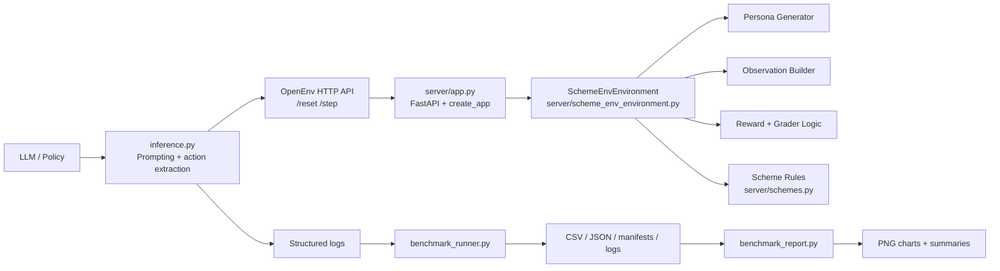
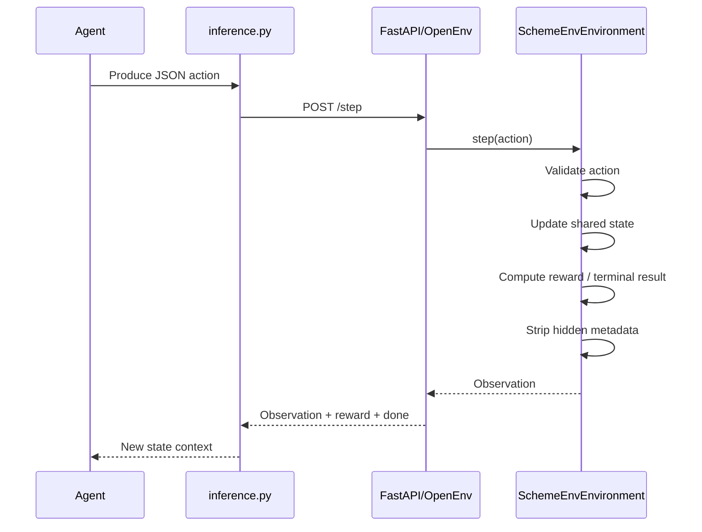
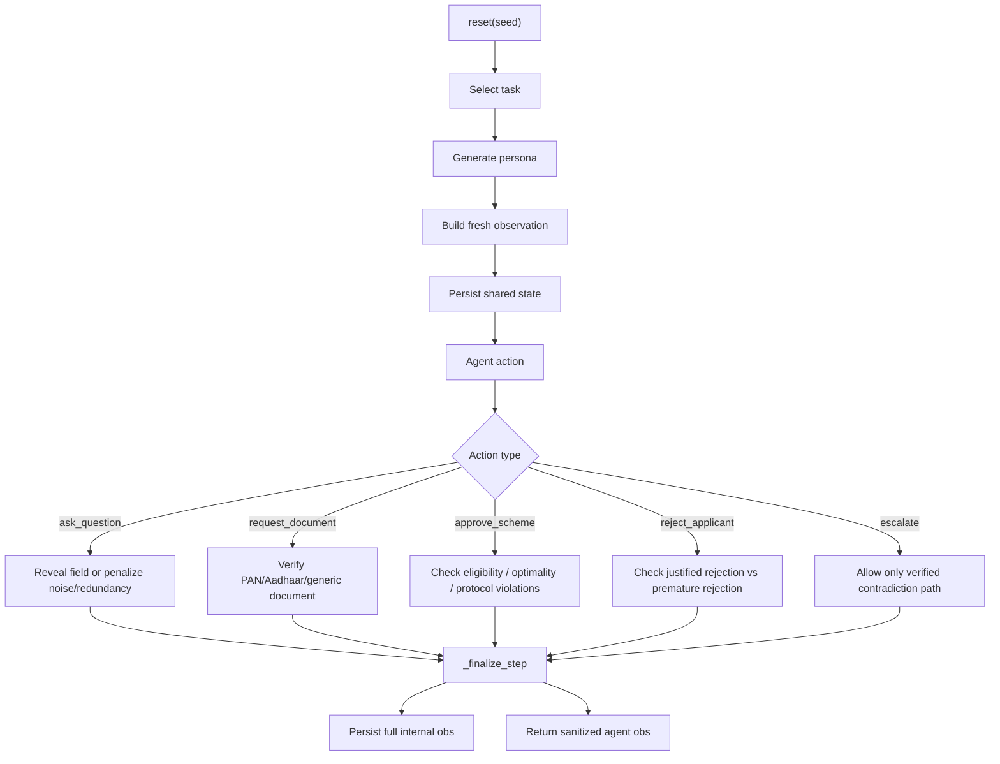
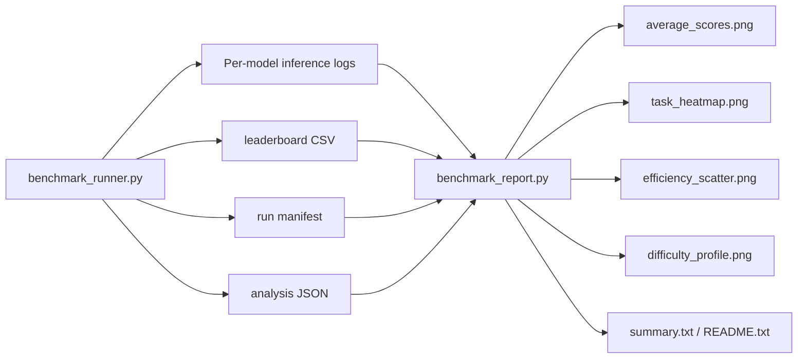

# Indian Government Welfare Officer RL Environment

An OpenEnv-compatible reinforcement learning environment that simulates the workflow of an Indian Common Service Centre (CSC) welfare officer. The agent must gather missing information, request the right document at the right time, apply strict integer eligibility rules, avoid being distracted by irrelevant fields, and make a safe terminal decision: approve, reject, or escalate.

This repo is built as both:

- an interactive environment server for agent evaluation
- a benchmarking toolkit with inference, reporting, and visualization pipelines

## Table of Contents

- [What This Benchmark Measures](#what-this-benchmark-measures)
- [Key Features](#key-features)
- [Repository Structure](#repository-structure)
- [Architecture](#architecture)
- [Environment Contract](#environment-contract)
- [Task Curriculum](#task-curriculum)
- [Scheme Rules](#scheme-rules)
- [Reward Model](#reward-model)
- [Grader Logic](#grader-logic)
- [Model and Data Flow](#model-and-data-flow)
- [Setup](#setup)
- [Running the Server](#running-the-server)
- [Running Inference](#running-inference)
- [Running the Benchmark Suite](#running-the-benchmark-suite)
- [Generating Reports](#generating-reports)
- [Testing](#testing)
- [Output Artifacts](#output-artifacts)
- [Design Tradeoffs](#design-tradeoffs)
- [Roadmap](#roadmap)

## What This Benchmark Measures

Most agent benchmarks emphasize generic reasoning. This environment instead targets procedural decision-making under operational constraints.

The benchmark measures whether an agent can:

1. gather missing information before making a decision
2. ignore irrelevant profile noise
3. apply strict income and age thresholds exactly
4. distinguish lack of information from true contradiction
5. use authoritative documents instead of trusting self-reported claims
6. escalate only when escalation is genuinely required

The result is a benchmark for "bureaucratic reasoning" rather than open-ended chat competence.

## Key Features

- OpenEnv-style `reset` and `step` loop
- FastAPI server entrypoint in [server/app.py](server/app.py)
- Typed `Action` and `Observation` schemas in [models.py](models.py)
- Five-task curriculum from scheme selection to document conflict handling
- Dynamic persona generation per episode
- Noise injection to punish irrelevant exploration
- Dense reward shaping plus normalized terminal grader score
- Metadata sanitization so agents cannot inspect hidden internal state
- OpenAI-compatible inference runner in [inference.py](inference.py)
- Sequential multi-model benchmark runner in [benchmark_runner.py](benchmark_runner.py)
- Graph-first benchmark reporting in [benchmark_report.py](benchmark_report.py)
- Unit tests for boundary logic and grading math in [tests/test_scheme_eligibility.py](tests/test_scheme_eligibility.py)

## Repository Structure

```text
rl-agent-main/
├── README.md
├── pyproject.toml
├── requirements.txt
├── uv.lock
├── Dockerfile
├── openenv.yaml
├── .env.example
├── models.py
├── inference.py
├── benchmark_runner.py
├── benchmark_report.py
├── server/
│   ├── __init__.py
│   ├── app.py
│   ├── models.py
│   ├── scheme_env_environment.py
│   └── schemes.py
├── tests/
│   ├── conftest.py
│   └── test_scheme_eligibility.py
└── reports/
    └── baseline_report/
```

### What each major file does

- [server/app.py](server/app.py): wires the environment into OpenEnv/FastAPI and exposes `/health`
- [server/scheme_env_environment.py](server/scheme_env_environment.py): environment state machine, persona generation, task logic, reward shaping, metadata stripping
- [server/schemes.py](server/schemes.py): benchmark scheme rules plus extended future scheme metadata
- [models.py](models.py): action validation and observation schema
- [inference.py](inference.py): one-model evaluation loop against a running server
- [benchmark_runner.py](benchmark_runner.py): runs a configured model suite sequentially and stores raw artifacts
- [benchmark_report.py](benchmark_report.py): parses run artifacts and renders charts plus summary outputs
- [reports/baseline_report](reports/baseline_report): sample benchmark bundle with logs, plots, and summary files

## Architecture

The repo has four main layers:

1. Environment runtime layer
2. Agent interaction layer
3. Benchmark orchestration layer
4. Reporting and analysis layer

### High-level architecture



### Environment internals

The core environment is implemented in [server/scheme_env_environment.py](server/scheme_env_environment.py). It handles:

- persona generation
- task selection
- observation construction
- state persistence
- action dispatch
- reward assignment
- terminal grading
- metadata sanitization before agent-facing return

Important implementation details:

- The environment is explicitly single-session: `SUPPORTS_CONCURRENT_SESSIONS = False`
- Shared state is stored at the class level so per-request server instantiation does not lose the active episode
- A `threading.Lock` guards `reset()` and `step()` to keep state transitions atomic
- Hidden metadata such as `pan_verified`, `aadhaar_verified`, and internal task labels are removed before the observation is returned to the agent

### Why metadata stripping matters

The environment tracks internal fields used for branching and grading, but agents should not see them. If the model could inspect flags like `pan_verified` or `grader_score` before termination, it could game the benchmark instead of reasoning about the case.

This is why `_finalize_step()` deep-copies the full observation and exposes only:

- `noise_queries`
- `redundant_queries`
- `relevant_queries`

to the agent.

### Architecture deep dive

#### 1. Action validation layer

[models.py](models.py) strictly validates:

- allowed `action_type`
- allowed `ask_question` fields
- allowed document names
- allowed scheme names
- allowed reject/escalate categories

This is important for environment integrity. Malformed actions do not silently drift through the benchmark.

#### 2. Persona generation layer

Every `reset()` creates a fresh persona with controlled randomness. The profile values change, but the intended reasoning challenge for each task remains stable.

Examples:

- Task 1 may be either PMKVY-optimal or PMAY-optimal depending on age and income overlap
- Task 3 always hides a near-miss income boundary violation
- Task 4 always contains a contradiction discoverable via PAN verification
- Task 5 always contains a self-reported vs Aadhaar age conflict

#### 3. Observation shaping layer

The observation builder deliberately withholds some fields at episode start. The agent must earn them through `ask_question` or `request_document`.

It also injects noise fields such as:

- `marital_status`
- `state_of_residence`
- `number_of_children`
- `bank_name`

These fields are designed to tempt weak agents into wasted exploration.

#### 4. Transition and recovery layer

Not every wrong action immediately terminates the episode.

The environment includes soft-block behavior for some protocol mistakes:

- approving Task 4 before PAN verification
- approving Task 5 before Aadhaar verification
- rejecting Task 4 before PAN verification
- rejecting Task 5 before Aadhaar verification
- escalating Task 4 before PAN verification

In these cases the agent is penalized, but the episode stays open so it can recover and still demonstrate correct policy-following.

#### 5. Benchmark and reporting layer

The repo separates execution from visualization:

- [benchmark_runner.py](benchmark_runner.py) produces raw run bundles
- [benchmark_report.py](benchmark_report.py) parses bundles and generates charts

This keeps benchmarking reproducible and lets you regenerate reports without rerunning expensive model inference.

## Environment Contract

The server exposes an OpenEnv-compatible HTTP environment with:

- `POST /reset`
- `POST /step`
- `GET /health`

The runtime metadata in [openenv.yaml](openenv.yaml) currently specifies:

- `name: scheme_env`
- `runtime: fastapi`
- `app: server.app:app`
- `port: 7860`
- `max_steps: 20`

### Action schema

| Action | Value | Notes |
|---|---|---|
| `ask_question` | `age`, `income`, `occupation`, `has_aadhaar` | Collect eligibility-critical fields |
| `request_document` | `aadhaar_card`, `pan_card`, `aadhaar`, `pan` | Request authoritative evidence |
| `approve_scheme` | `PMKVY`, `MGNREGS`, `PMAY` | Approve a scheme |
| `reject_applicant` | category string | Reject with a compact reason code |
| `escalate` | empty string or category string | Escalate to manual review |

### Observation schema

| Field | Meaning |
|---|---|
| `known_profile` | Currently visible applicant data |
| `missing_data` | Fields still required before a safe decision |
| `notification` | Environment feedback on previous action |
| `is_terminated` | Episode end flag |
| `grader_score` | Terminal normalized score |
| `metadata` | Sanitized counters only |

## Task Curriculum

The environment currently implements five tasks.

### Task 1: Scheme Discovery

- Agent starts with an incomplete profile
- Must collect remaining required fields
- Must choose the optimal scheme, not just an eligible one
- PMAY can outrank PMKVY when both apply

Failure mode tested: shallow first-match approval.

### Task 2: Missing Data

- Occupation and Aadhaar status are hidden
- Missing field order is randomized
- Any approval before all missing data is collected is terminally wrong

Failure mode tested: premature decision-making.

### Task 3: Boundary Fraud Detection

- Income is hidden initially
- Agent must collect income before rejecting
- Income is always above the PMKVY threshold by a small but real margin
- Wrong approvals receive graded penalties based on overage size

Failure mode tested: fuzzy arithmetic instead of exact rule-following.

### Task 4: Escalation Dilemma

- Profile presents a suspicious `student` with unusually high income
- PAN verification reveals active long-term government employment
- Correct resolution is escalation after document verification

Failure mode tested: confusing contradiction with ordinary ineligibility.

### Task 5: Document Conflict

- Self-reported age appears near PMKVY eligibility boundary
- Aadhaar reveals a true age above the upper bound
- Correct resolution is request Aadhaar, then reject

Failure mode tested: trusting self-reported evidence over authoritative documents.

## Scheme Rules

The benchmark-active schemes are:

| Scheme | Age | Occupation | Income | Aadhaar |
|---|---|---|---|---|
| `PMKVY` | 18-35 inclusive | `mason` or `carpenter` | `<= 9999` | not required |
| `MGNREGS` | 18-60 inclusive | `farm_labourer` only | no ceiling | required |
| `PMAY` | 21-55 inclusive | any | `<= 5999` | required |

### Priority order

The benefit hierarchy used by the benchmark is:

```text
PMAY > MGNREGS > PMKVY
```

This matters because some profiles qualify for more than one scheme, and the agent is expected to choose the highest-benefit option.

### Extended scheme metadata

[server/schemes.py](server/schemes.py) also defines additional future-facing schemes:

- `PM_SYM`
- `AYUSHMAN_BHARAT`
- `E_SHRAM`
- `NFSA`
- `PMMVY`

These are mostly unreachable from the current sparse benchmark tasks because they require profile fields not present in Tasks 1 to 5.

## Reward Model

The benchmark uses dense rewards plus terminal scoring.

### Step-level rewards

| Event | Reward |
|---|---|
| Valid question | `0.0` |
| Valid document request | `0.0` |
| Noise or redundant query | `-0.10` |
| Correct optimal approval | `+10.0` |
| Eligible but suboptimal approval | `+3.0` |
| Correct rejection | `+5.0` |
| Correct escalation | `+10.0` |
| Timeout | `-2.0` |

### Important nuance

The current implementation intentionally gives `0.0` reward for valid information-gathering steps. Good exploration is not rewarded directly; instead, wasted exploration is penalized lightly and terminal correctness carries most of the score signal.

### Task-specific penalty behavior

- Task 3 wrong approvals use tiered penalties based on how far income exceeds threshold
- Some policy violations in Tasks 4 and 5 are recoverable soft-blocks rather than immediate terminations
- Premature approvals in Tasks 1 and 2 remain terminal failures

## Grader Logic

Terminal outcomes are converted into a normalized `grader_score` in `[0.0, 1.0]`.

```text
grader_score = max(0.30, min(1.0, base_score - penalty + bonus))
```

Where:

- wrong terminal decisions return `0.0`
- correct decisions are floored at `0.30`
- noise and redundant queries reduce the score
- document verification can add a small bonus
- Task 2 also penalizes wasted steps beyond the theoretical minimum

### Penalties and bonus

```text
penalty =
  (noise_queries * 0.08) +
  (redundant_queries * 0.05) +
  (wasted_steps * 0.04)   # Task 2 only

bonus =
  0.05 if document_verified else 0.0
```

### Why separate reward and grader score

- reward helps RL-style learning
- grader score makes model comparisons stable and leaderboard-friendly
- a model can accumulate neutral steps and still fail the episode
- the benchmark wants correctness, not just activity

## Model and Data Flow

### Episode flow



### Reset and step architecture



### Benchmark pipeline



## Setup

The repo supports both `uv`-based and `pip`-based flows.

### Python requirements

- Python `>=3.10`
- FastAPI
- Uvicorn
- openenv-core
- Pydantic v2
- OpenAI Python SDK
- python-dotenv

### Install with `uv`

```bash
uv sync
```

### Install with `pip`

```bash
python -m venv .venv
source .venv/bin/activate
pip install -r requirements.txt
```

### Development dependencies

```bash
pip install -e ".[dev]"
```

## Running the Server

### With Python directly

```bash
python -m server.app
```

### With Uvicorn

```bash
uvicorn server.app:app --host 0.0.0.0 --port 7860
```

### Health check

```bash
curl http://localhost:7860/health
```

## Running Inference

The inference runner talks to:

- a running local environment server
- an OpenAI-compatible model endpoint

Example:

```bash
export ENV_URL=http://localhost:7860
export API_BASE_URL=https://router.huggingface.co/v1
export MODEL_NAME=Qwen/Qwen2.5-7B-Instruct
export HF_TOKEN=your_token
export INFERENCE_TEMPERATURE=0.0
export MAX_TOKENS=1500
export N_REPEATS=3

python inference.py
```

### Provider compatibility notes

[inference.py](inference.py) includes provider normalization logic:

- Hugging Face website URLs are rewritten to `https://router.huggingface.co/v1`
- deprecated Hugging Face Inference API model URLs are normalized to Router
- the same code path can be used with Hugging Face Router or NVIDIA NIM

### Example NVIDIA NIM setup

```bash
export ENV_URL=http://localhost:7860
export API_BASE_URL=https://integrate.api.nvidia.com/v1
export MODEL_NAME=nvidia/llama-3.1-nemotron-70b-instruct
export OPENAI_API_KEY=your_nvidia_key

python inference.py
```

## Running the Benchmark Suite

[benchmark_runner.py](benchmark_runner.py) runs a configured list of models sequentially.

Sequential execution is intentional because the environment is single-session.

```bash
python benchmark_runner.py
```

The runner:

- waits for the server health check to pass
- evaluates the configured model list one at a time
- repeats each task multiple times
- extracts structured scores from inference logs
- stores logs, CSV output, manifest JSON, analysis JSON, and text summaries

## Generating Reports

Use [benchmark_report.py](benchmark_report.py) to build graph-first summaries from a benchmark run.

### From a timestamped run directory

```bash
python benchmark_report.py --run-dir reports/report_<timestamp>
```

### From the latest discovered run

```bash
python benchmark_report.py --latest
```

### From explicit artifacts

```bash
python benchmark_report.py \
  --csv reports/report_<timestamp>/leaderboard_<timestamp>.csv \
  --logs-dir reports/report_<timestamp>/logs_<timestamp>
```

## Testing

The unit tests focus on the parts of the benchmark that most often regress:

- scheme boundary comparisons
- optimal scheme ordering
- grader score clamping and penalty math

Run:

```bash
pytest tests/
```

Covered examples include:

- `PMKVY` age and income boundary conditions
- `PMAY` strict `5999` vs `6000` threshold behavior
- `MGNREGS` Aadhaar requirements
- `get_optimal_scheme()` hierarchy correctness
- `_compute_grader_score()` floor and penalty math

## Output Artifacts

The repo already includes a baseline artifact bundle under [reports/baseline_report](reports/baseline_report).

Typical generated outputs include:

- `leaderboard.csv`
- `results.json`
- `summary.txt`
- `README.txt`
- `average_scores.png`
- `task_heatmap.png`
- `efficiency_scatter.png`
- `difficulty_profile.png`
- `inference_logs/`
- `test_logs/`

For fresh runs produced by [benchmark_runner.py](benchmark_runner.py), the current expected layout is:

- `reports/report_<timestamp>/leaderboard_<timestamp>.csv`
- `reports/report_<timestamp>/logs_<timestamp>/`
- `reports/report_<timestamp>/run_manifest_<timestamp>.json`
- `reports/report_<timestamp>/analysis_<timestamp>.json`
- `reports/report_<timestamp>/summary_<timestamp>.txt`

## Design Tradeoffs

### Single-session shared state

The environment prioritizes correctness and simple persistence across HTTP requests over concurrency. This keeps implementation straightforward, but it means evaluation should remain sequential.

### Sanitized observations

The benchmark avoids leaking internal truth flags. That makes the environment more faithful as an evaluation tool, even though it adds some implementation complexity.

### Soft-blocks for recoverable mistakes

Some protocol violations in Tasks 4 and 5 do not instantly end the episode. This gives more nuanced behavioral signal and better reflects operational workflows where an officer can still correct course.

### Narrow benchmark profile, broader future catalog

Current tasks use a sparse four-field profile core:

- `age`
- `income`
- `occupation`
- `has_aadhaar`

But the repo already contains extended scheme metadata for future richer tasks.

## Roadmap

High-value next steps suggested by the current codebase:

1. add end-to-end tests for actual `reset` and `step` trajectories, not just pure helper logic
2. document the run-manifest and analysis JSON schemas more explicitly
3. expose a canonical agent-facing observation model instead of sanitizing inline in `_finalize_step()`
4. add benchmark fixtures for Task 4 and Task 5 recovery paths
5. expand reporting docs with example interpretation of each chart
6. consider session-safe state storage if parallel evaluation becomes necessary

## Summary

This repo is a strong benchmark for rule-bound agent behavior. Its most interesting architectural feature is not just the task list, but the combination of:

- partial observability
- authoritative document verification
- exact integer thresholds
- contradiction-aware escalation
- hidden internal state with sanitized agent views

That combination makes it a useful testbed for evaluating whether a model can act like a careful operator, not just produce plausible language.
